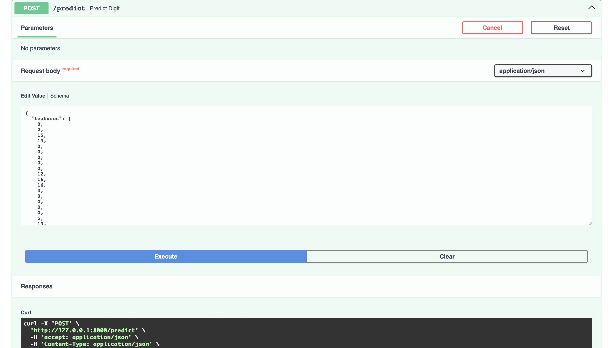

# Handwritten Digits Classification API with FastAPI

* Reference Video Explanation: [FastAPI lab](https://www.youtube.com/watch?v=KReburHqRIQ&list=PLcS4TrUUc53LeKBIyXAaERFKBJ3dvc9GZ&index=4)
* Reference Blog: [FastAPI Lab-1](https://www.mlwithramin.com/blog/fastapi-lab1)

---

## Overview

In this Lab, we will learn how to expose ML models as APIs using [FastAPI](https://fastapi.tiangolo.com/) and [uvicorn](https://www.uvicorn.org/).

1. **FastAPI**: A modern, high-performance web framework for building APIs with Python.
2. **uvicorn**: An [ASGI](https://youtu.be/vKjCkeJGbNk) web server implementation for Python, commonly used to serve FastAPI apps.

The workflow involves the following steps:

1. Training a **RandomForest Classifier** on the **Handwritten Digits dataset** from scikit-learn.
2. Serving the trained model as an API using FastAPI and uvicorn.
3. Exposing endpoints for prediction and sampling test data.

---

## Setting up the Lab

1. Create a virtual environment (e.g. **fastapi\_digits\_env**).
2. Activate the environment and install dependencies:

   ```bash
   pip install -r requirements.txt
   ```

### Project structure

```
mlops_labs
└── fastapi_digits
    ├── assets/
    ├── fastapi_digits_env/
    ├── model/
    │   └── digits_model.pkl
    ├── src/
    │   ├── __init__.py
    │   ├── data.py
    │   ├── main.py
    │   ├── predict.py
    │   └── train.py
    ├── README.md
    └── requirements.txt
```

> **Note**:
>
> * **fastapi\[all]** in `requirements.txt` installs optional dependencies, including **uvicorn**.
> * The trained model is stored at `model/digits_model.pkl`.

---

## Running the Lab

1. Move into the **src/** folder:

   ```bash
   cd src
   ```

2. Train the **RandomForest Classifier** on the Digits dataset:

   ```bash
   python train.py
   ```

   This will generate the model file `model/digits_model.pkl`.

3. Serve the trained model as an API:

   ```bash
   uvicorn main:app --reload
   ```

4. Test the API endpoints:

   * API documentation: [http://127.0.0.1:8000/docs](http://127.0.0.1:8000/docs)
   * Alternative: [http://localhost:8000/docs](http://localhost:8000/docs)


You can interact with endpoints directly from the docs by clicking **Try it out**.



> You can also test endpoints using [Postman](https://www.postman.com/) or `curl`.

---

## API Endpoints

### 1. Health Check

* **GET** `/`
* Returns:

  ```json
  {"status": "healthy"}
  ```

### 2. Predict Digit

* **POST** `/predict`

* Request Body:

  ```json
  {
    "features": [0.0, 0.0, 5.0, 13.0, 9.0, 1.0, 0.0, 0.0, ... 64 values ...]
  }
  ```

  (64 features = 8x8 flattened grayscale digit image)

* Response:

  ```json
  {
    "response": 3
  }
  ```

### 3. Random Sample

* **GET** `/sample`
* Returns a random digit sample from the dataset with its features, true label, and predicted label.
* Response:

  ```json
  {
    "features": [0.0, 0.0, 10.0, 14.0, 8.0, 1.0, 0.0, 0.0, ...],
    "predicted": 8,
    "true_label": 8
  }
  ```

---

## Data Models in FastAPI

### 1. DigitData (Request Model)

```python
class DigitData(BaseModel):
    features: List[float]   # Must contain exactly 64 values
```

* Defines the expected request body for digit prediction.
* Validates length (64 values) and type (float).

### 2. DigitResponse (Response Model)

```python
class DigitResponse(BaseModel):
    response: int
```

* Defines the structure of the prediction response.

### 3. SampleResponse (Helper Endpoint)

```python
class SampleResponse(BaseModel):
    features: List[float]
    predicted: int
    true_label: int
```

* Used for `/sample` endpoint to test the API with real dataset samples.

---

## FastAPI Features Demonstrated

1. **Request validation** with Pydantic models.
2. **Response serialization** for structured API outputs.
3. **Interactive API docs** with Swagger UI (`/docs`).
4. **Error handling** with `HTTPException` for invalid inputs.
5. **Asynchronous endpoints** (`async def`) for concurrency.

---

## Example `curl` Requests

### Predict Digit

```bash
curl -X POST "http://127.0.0.1:8000/predict" \
-H "Content-Type: application/json" \
-d '{"features": [0.0,0.0,5.0,13.0,9.0,1.0,0.0,0.0, ... 64 values ...]}'
```

### Get Random Sample

```bash
curl http://127.0.0.1:8000/sample
```

---
